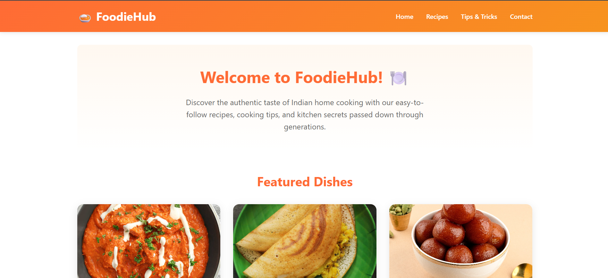

# FoodieHub 🍽️

FoodieHub is a simple and clean website built using HTML and CSS that showcases Indian recipes, cooking tips, and featured dishes.

## 🚀 Features

* Clean and modern user interface
* Navigation bar (Home, Recipes, Tips & Tricks, Contact)
* Featured dishes section with images
* Beginner-friendly design

## 🛠️ Technologies Used

* HTML5
* CSS3

## 📁 Project Structure

```
FoodieHub/
│── index.html
│── style.css
│── images/
```

## 🌐 Live Demo

👉 https://atharvtalwar.github.io/FoodieHub/

## 📸 Preview

<p align="center">
  
</p>

## 📌 Future Improvements

* Add responsiveness (mobile support)
* Add JavaScript for interactivity
* Add more recipe pages

## 👤 Author

Atharv Talwar
